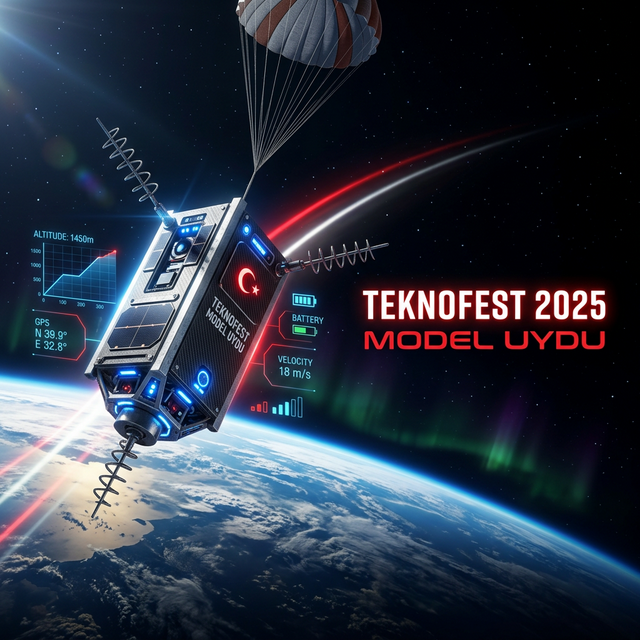
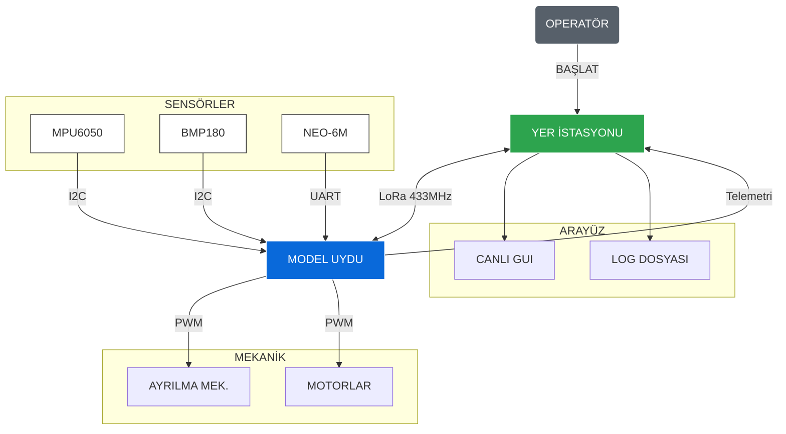

# 🌌 TEKNOFEST MODEL UYDU: GÖREV KONTROL MERKEZİ

<div align="center">
  
</div>

<br>

<div align="center">


</div>

---

## 📑 İÇİNDEKİLER
1.  [Proje Özeti](#-proje-özeti)
2.  [Dosya Yapısı](#-dosya-yapısı)
3.  [Sistem Mimarisi](#-sistem-mimarisi)
4.  [Yazılım Mimarisi ve Algoritmalar](#-yazilim-mimarisi-ve-algoritmalar)
5.  [Uçuş Durum Makinesi (FSM)](#-ucuş-durum-makinesi-fsm)
6.  [Mekanik Tasarım Detayları](#-mekanik-tasarim-detaylari)
7.  [Telemetri Protokolü](#-telemetri-protokolü)
8.  [Donanım Envanteri](#-donanım-envanteri)
9.  [Güvenlik ve Uçuş Öncesi Kontroller](#-güvenlik-ve-uçuş-öncesi-kontroller)
10. [Kurulum ve Çalıştırma](#-kurulum-ve-calistirma)
11. [Gelecek Planları ve Yol Haritası](#-gelecek-planları-ve-yol-haritası)
12. [🌍 Rakip Analizi: Küresel Model Uydu Yarışmaları](#-rakip-analizi-küresel-model-uydu-yarışmaları)
13. [İletişim ve Katkı](#-iletişim-ve-katkı)

---

## 📋 PROJE ÖZETİ

Bu depo, **Teknofest Model Uydu Yarışması** kapsamında geliştirilen, yüksek irtifa ve otonom görev yeteneklerine sahip model uydu sisteminin ana mühendislik dokümantasyonunu ve kaynak kodlarını içerir. Sistem, 700 metre irtifadan serbest bırakıldıktan sonra kontrollü bir iniş gerçekleştirmek, belirlenen irtifada görev yükünü ayırmak (payload separation) ve tüm bu süreç boyunca yer istasyonuna kesintisiz telemetri verisi aktarmak üzere tasarlanmıştır.

---

## 📂 DOSYA YAPISI

Proje, endüstriyel standartlara uygun, modüler bir dizin yapısına sahiptir.

```text
teknofest_model_uydu/
├── assets/                 # Görsel materyaller (Banner, Logo vb.)
├── docs/                   # Teknik raporlar ve kullanım kılavuzları
├── hardware/               # Elektronik ve Mekanik tasarım dosyaları
│   ├── 3D_Models/          # .STL ve .STEP şasi dosyaları
│   └── PCB_Layout/         # Altium/KiCad devre şemaları
├── src/                    # Kaynak kodlar (Ana Yazılım)
│   ├── main.py             # Yer İstasyonu Başlatıcı
│   └── telemetry.py        # Veri Ayrıştırma ve Simülasyon Modülü
├── tests/                  # Birim testleri ve senaryo simülasyonları
├── .gitignore              # Git tarafından yok sayılacak dosyalar
├── README.md               # Ana proje dokümantasyonu (Bu dosya)
└── requirements.txt        # Python bağımlılık listesi
```

---

## 🧠 SİSTEM MİMARİSİ

Sistem, gerçek zamanlı veri akışını ve kontrol döngülerini güvence altına alan hiyerarşik bir mimariye sahiptir.



---

## 💻 YAZILIM MİMARİSİ VE ALGORİTMALAR

Uydu üzerindeki yazılım (On-Board Software), kritik zamanlı karar verme süreçlerini yönetir.

### 1. Sensör Füzyonu (Genişletilmiş Kalman Filtresi)
MPU6050'den alınan ivmeölçer ve jiroskop verileri ile barometrik irtifa verileri, **Genişletilmiş Kalman Filtresi (EKF)** kullanılarak birleştirilir.
*   **Giriş:** Ham İvme, Ham Açısal Hız, Ham Basınç.
*   **Çıkış:** Filtrelenmiş Roll/Pitch/Yaw açıları, Tahmini İrtifa.

### 2. İniş Kontrolü (PID Denetleyici)
Aktif iniş sistemi kullanılması durumunda, uydunun iniş hızı **PID** kontrolcü tarafından yönetilir.
*   **Hedef:** 12-14 m/s sabit iniş hızı.
*   **Çıktı:** ESC/Motor PWM sinyali.

---

## 🔄 UÇUŞ DURUM MAKİNESİ (FSM)

| DURUM ID | DURUM ADI | TETİKLEYİCİ KOŞUL | EYLEM |
| :--- | :--- | :--- | :--- |
| **0** | **BEKLEME (IDLE)** | Sistem Başlangıcı | Sensör kalibrasyonu, GPS kilidi bekleme. |
| **1** | **YÜKSELME (ASCENT)** | P > P_ref + 10m | Veri kaydı başlangıcı, yükselme tespiti. |
| **2** | **MODEL UYDU İNİŞ** | Hız < 0 && İrtifa Maks | Serbest düşüş algılama, paraşüt açılması. |
| **3** | **AYRILMA (SEPARATION)** | İrtifa <= 400m | Servo tetikleme, görev yükü ayrılması. |
| **4** | **GÖREV YÜKÜ İNİŞ** | Mekanik Switch | Aktif iniş kontrolü, video aktarımı. |
| **5** | **KURTARMA (RECOVERY)** | İrtifa ~ 0m ve Hız 0 | Buzzer aktivasyonu, konum yayını. |

---

## ⚙️ MEKANİK TASARIM DETAYLARI

*   **Şasi:** PLA+ ve PETG (3 D Yazıcı). İç iskelet %40 doluluk.
*   **Ayrılma:** Tek noktalı servo mekanizması + Yaylı itici sistem.
*   **Aerodinamik:** Pasif dikey stabilizasyon kanatçıkları.

---

## 📡 TELEMETRİ PROTOKOLÜ

**Format:** `<TAKIM_ID>,<PAKET_NO>,<ENLEM>,<BOYLAM>,<İRTİFA>,<HIZ>,<SICAKLIK>,<VOLTAJ>,<DURUM>`

| SIRA | PARAMETRE | BİRİM |
| :--- | :--- | :--- |
| 0 | TAKIM NO (UINT16) | - |
| 1 | PAKET NO (UINT16) | - |
| 2,3 | GPS KONUM (FLOAT) | Derece |
| 4 | İRTİFA (FLOAT) | Metre |
| 5 | HIZ (FLOAT) | m/s |
| 6 | SICAKLIK (FLOAT) | °C |
| 7 | PİL (FLOAT) | V |
| 8 | DURUM (INT) | FSM Kodu |

---

## 🛠 DONANIM ENVANTERİ

| BİLEŞEN | MODEL |
| :--- | :--- |
| **MCU** | STM32F446RE |
| **RF** | Ebyte E32 (433MHz) |
| **IMU** | MPU6050 |
| **BARO** | BMP180 |
| **GPS** | NEO-6M |

---

## 🛡️ GÜVENLİK VE UÇUŞ ÖNCESİ KONTROLLER

1.  [ ] **Mekanik:** Vidalar sıkı, çatlak yok.
2.  [ ] **Enerji:** LiPo > 12.4V.
3.  [ ] **Link:** Telemetri RSSI > -90dBm.
4.  [ ] **GPS:** 6+ Uydu kilidi.
5.  [ ] **Ayrılma:** Manuel test başarılı.

---

## ⚡ KURULUM VE ÇALIŞTIRMA

```powershell
python -m venv env
.\env\Scripts\activate
pip install -r requirements.txt
python src/main.py
```

---

## 🚀 GELECEK PLANLARI VE YOL HARİTASI

- [ ] **Görüntü İşleme:** Gerçek zamanlı iniş alanı tespiti.
- [ ] **IoT Dashboard:** Verilerin bulut sunucuya (AWS/Azure) aktarımı.
- [ ] **Dual-Link:** Yedekli haberleşme sistemi (868MHz + 433MHz).
- [ ] **Mobil Uygulama:** Flutter tabanlı saha kontrol uygulaması.

---

## 🌍 RAKİP ANALİZİ: KÜRESEL MODEL UYDU YARIŞMALARI

> Bu bölüm, dünyanın önde gelen model uydu (CanSat) yarışmalarını ve açık kaynak projelerini karşılaştırmalı olarak analiz etmektedir. Amacımız; kendi sistemimizin güçlü ve geliştirilebilir yönlerini ortaya koymak, uluslararası standartları anlamak ve rakip çözüm yaklaşımlarından ders çıkarmaktır.

---

### 1. 🇪🇺 ESA CanSat Yarışması (Avrupa Uzay Ajansı)

**Organizatör:** European Space Agency (ESA) & ESERO Ağı
**Hedef Kitle:** Lise öğrencileri (14-19 yaş), Avrupa geneli
**Resmi Kaynak:** [https://www.esa.int/Education/CanSat](https://www.esa.int/Education/CanSat)
**Şartname (ESERO NL):** [https://www.esero.nl/cansat-requirements](https://www.esero.nl)

**Teknik Şartname Özeti:**

| Parametre | ESA CanSat Gereksinimi |
|:---|:---|
| **Boyut (çap × yükseklik)** | ≤ 66 mm × 115 mm (standart kutu) |
| **Ağırlık** | 300 – 350 gram |
| **Bütçe Sınırı** | ≤ €500 |
| **Pil Ömrü** | ≥ 4 saat kesintisiz |
| **Takım Büyüklüğü** | 3-6 öğrenci + 1 mentor |
| **Birincil Görev** | Sıcaklık + Basınç ölçümü, 1 Hz telemetri |
| **İkincil Görev** | Tamamen takıma bırakılmış (yaratıcı görev) |
| **Kurtarma Sistemi** | Paraşüt (yeniden kullanılabilir) |
| **İletişim** | RF yayın, yer istasyonuna CSV çıktısı |

**📌 Bizimle Karşılaştırma:** ESA yarışması lise düzeyinde olup sınırlı bütçe ve boyut kısıtlamaları içermektedir. Bizim sistemimiz üniversite düzeyinde STM32F446RE tabanlı, EKF sensör füzyonu ve PID irtifa kontrolü ile çok daha gelişmiş bir platform sunmaktadır. ESA'da ikincil görev serbest bırakılmışken, bizim sistemimizde **payload separation** ve **aktif iniş kontrolü** zorunlu bir görev olarak tanımlanmıştır.

---

### 2. 🇺🇸 AAS/AIAA CanSat Yarışması (ABD)

**Organizatör:** American Astronautical Society (AAS) & AIAA
**Hedef Kitle:** Üniversite öğrencileri (lisans/lisansüstü)
**Resmi Kaynak:** [https://www.cansatcompetition.com](https://www.cansatcompetition.com)
**2024 Görev Kuralları (PDF):** [https://www.cansatcompetition.com/docs/rules.pdf](https://www.cansatcompetition.com)

**Teknik Şartname Özeti (2024):**

| Parametre | AAS/AIAA CanSat Gereksinimi |
|:---|:---|
| **Misyon Konsepti** | Gezegenlerarası sonda simülasyonu |
| **Ağırlık** | 900 gram ± 10 gram |
| **Maliyet Sınırı** | ≤ $1,000 (yer ekipmanı hariç) |
| **İniş Fazı 1** | Paraşüt ile 15 m/s hızda iniş |
| **İniş Fazı 2 (500m)** | Isı kalkanı (aerobraking), ≤ 20 m/s, paraşüt YOK |
| **İniş Fazı 3 (200m)** | Paraşüt açılır, ≤ 5 m/s iniş hızı |
| **İniş Sonrası** | Kendini dik tutma + bayrak kaldırma mekanizması |
| **Kamera** | Gövde kamerası, yere bakan |
| **Telemetri** | 1 Hz iletim zorunlu |
| **İletişim** | RF (XBee benzeri), CSV veri kaydı |

**GitHub Örnek Repo:** [https://github.com/whoisjayd/teknofest-model-satellite-gui-telemetry](https://github.com/whoisjayd/teknofest-model-satellite-gui-telemetry)

**📌 Bizimle Karşılaştırma:** AAS/AIAA yarışması, çok fazlı iniş profili ve iniş sonrası özerk mekanik görev (bayrak kaldırma) ile teknik derinlik açısından en gelişmiş üniversite yarışmalarından biridir. Bizim sistemimizin **400m'de payload separation** mekanizması bu yarışmayla doğrudan karşılaştırılabilir niteliktedir. XBee tabanlı telemetri protokolü yerine biz **LoRa 433MHz (E32)** kullanmakta olup daha uzun menzil sağlamaktayız. Isı kalkanı (heat shield) sistemi bizim mimarimizde **aerodinamik stabilizasyon kanatçıkları** ile ikame edilmiştir.

---

### 3. 🌐 WCRC – Dünya CanSat/Roket Şampiyonası

**Organizatör:** World CanSat/Rocketry Championship (WCRC) – DARE (TU Delft) iş birliği
**Hedef Kitle:** Tüm öğrenciler; ulusal eleme + dünya finali formatı
**Resmi Kaynak:** [https://www.wcrc.world](https://www.wcrc.world)
**2025 Şartnamesi (Scribd):** [https://www.scribd.com](https://www.scribd.com)

**Teknik Şartname Özeti (2025):**

| Parametre | WCRC 2025 Gereksinimi |
|:---|:---|
| **Toplam Kütle** | 1400 gram ± 10 gram (CanSat + konteyner) |
| **Konteynır Çapı** | 136 mm, et kalınlığı ≥ 2 mm |
| **Yükseklik Hedefi** | ~1 km (DARE CanSat Launcher V7) |
| **İniş Sistemi** | **Auto-gyro** iniş kontrol sistemi (özerk) |
| **Atalete Dayanıklılık** | 30 G şok dayanımı zorunlu |
| **Kamera** | 2 kamera: ayrılma kaydı + nadir yönelim |
| **Birincil Görev** | Sıcaklık + Basınç ≥ 1 Hz |
| **İletişim** | XBee 2.4GHz veya 900MHz, NETID = takım no |
| **Güç** | LiPo YASAK; alkalin/Ni-MH/Li-çelik hücre |
| **Pil Ömrü** | ≥ 2 saat entegre edilmiş halde |

**📌 Bizimle Karşılaştırma:** WCRC 2025'in en dikkat çekici yeniliği **auto-gyro iniş** sistemidir; kendi etrafında dönerek yavaşlayan bir rotor mekanizması gerektirmektedir. Bizim sistemimizde bu görev **PID kontrollü ESC/motor** ile icra edilmektedir; konsept farklı olsa da otonom iniş hedefi aynıdır. WCRC, LiPo pil kullanımını yasaklamaktayken biz **LiPo** kullanmaktayız — bu durum yarışma ortamına göre değiştirilmesi gereken bir parametredir. WCRC'nin ulusal + uluslararası eleme yapısı Teknofest'e kıyasla çok daha geniş bir rekabet havuzu oluşturmaktadır.

---

### 4. 🇹🇷 TEKNOFEST Model Uydu Yarışması (Ana Referans Yarışma)

**Organizatör:** T3 Vakfı & T.C. Sanayi ve Teknoloji Bakanlığı
**Hedef Kitle:** Lisans ve yüksek lisans öğrencileri (Türkiye)
**Resmi Kaynak:** [https://www.teknofest.org/tr/yarismalar/model-uydu-yarismasi/](https://www.teknofest.org/tr/yarismalar/model-uydu-yarismasi/)
**Başvuru & Duyurular:** [https://yarismaduyurulari.com](https://yarismaduyurulari.com)

**2025 Yarışma Kategorileri:**

| Kategori | Görev Tanımı | Takım Büyüklüğü | Ödül (1.) |
|:---|:---|:---|:---|
| **Kategori 1** | Multi-Spektral Mekanik Filtreleme Modülü | 3-6 kişi | 250,000 TL |
| **Kategori 2** | TICOSAT – TÜRKSAT Picosatellite Constellation | 3-8 kişi | 300,000 TL |
| **Kategori 3** | Yakın Uzay Yolcusu | 4-8 kişi | 300,000 TL |

**Değerlendirme Aşamaları:**
```
POR → PDR/DR → CDR/PGR → QR → FRR → Uçuş → PFR
```

**📌 Notlar:** Bu proje doğrudan Teknofest Model Uydu Yarışması için geliştirilmektedir. 2025 yılında ilk kez üç ayrı kategoride düzenlenen yarışma, **payload separation**, **telemetri**, **otonom iniş** ve **görüntü aktarımı** gibi kapsamlı görevler içermektedir. Uçuş profili (700m → serbest bırakma → 400m ayırma → yere iniş) doğrudan bu kural setine göre tasarlanmıştır.

---

### 5. 🌍 Açık Kaynak CanSat Referans Projeleri (GitHub)

Küresel CanSat topluluğunda öne çıkan, incelemeye ve katkıya değer açık kaynak projeler:

| Proje Adı | Açıklama | Teknoloji Yığını | Link |
|:---|:---|:---|:---|
| **whoisjayd/teknofest-model-satellite-gui-telemetry** | Türksat/Teknofest 2024 yarışması için TCP/UDP tabanlı yer istasyonu GUI'si | Python, PyQt5 | [GitHub](https://github.com/whoisjayd/teknofest-model-satellite-gui-telemetry) |
| **GTUMerkutCansat** | Gebze Teknik Üniversitesi CanSat 18 projesinin komple yazılım paketi (uçuş + yer) | Arduino, JavaFX | [GitHub](https://github.com/ugurkanates/GTUMerkutCansat) |
| **OreSat** | Portland State Üniversitesi, tam açık kaynaklı nanosatellite mimarisi | C, Python, KiCad | [GitHub](https://github.com/oresat) |
| **PyCubed** | Carnegie Mellon Üniversitesi, CubeSat için açık kaynak donanım/yazılım framework | CircuitPython, PCB | [GitHub](https://github.com/pycubed) |
| **LibreCube** | IARU destekli tam açık kaynak CubeSat geliştirme standartları | Multidisciplinary | [GitHub](https://github.com/librecube) |
| **openCanSat** | CanSat yarışmalarına giriş kiti; dedike Arduino Shield + sensörler | Arduino Uno, C++ | [GitHub](https://github.com/openCanSat) |

---

### 📊 Kapsamlı Karşılaştırma Tablosu

| Kriter | **Bu Proje** | ESA CanSat | AAS/AIAA | WCRC 2025 | Teknofest 2025 |
|:---|:---:|:---:|:---:|:---:|:---:|
| **Seviye** | Üniversite | Lise | Üniversite | Her seviye | Üniversite |
| **İrtifa Hedefi** | 700 m | ~300 m | ~740 m | ~1000 m | 700 m |
| **Payload Ayrılma** | ✅ 400 m | ❌ | ✅ 500 m | ✅ | ✅ |
| **Aktif İniş Kontrolü** | ✅ PID | ❌ | ❌ | ✅ Auto-gyro | ✅ |
| **Sensör Füzyonu (EKF)** | ✅ | ❌ | ❌ | ❌ | Tanımsız |
| **RF Haberleşme** | LoRa 433 MHz | Genel RF | XBee | XBee | LoRa/433 MHz |
| **Maliyet Kısıtı** | Yok | €500 | $1,000 | Yok | Yok |
| **MCU** | STM32F446RE | Arduino/RPi | Herhangi | Herhangi | Herhangi |
| **Video Kaydı** | Planlı | ❌ | ✅ Zorunlu | ✅ 2 Kamera | ✅ Zorunlu |
| **Pil Tipi** | LiPo | Herhangi | Herhangi | **LiPo YASAK** | Tanımsız |
| **Açık Kaynak** | ✅ MIT | ❌ | ❌ | ❌ | ❌ |

> **Genel Değerlendirme:** Projemiz, üniversite seviyeli CanSat yarışmaları arasında **EKF sensör füzyonu** ve **PID irtifa kontrolü** kombinasyonuyla öne çıkmaktadır. ESA'ya kıyasla çok daha karmaşık, WCRC'nin auto-gyro sistemine kıyasla ise farklı ancak eşdeğer otonom iniş yaklaşımı benimsenmektedir. AAS/AIAA ile en yakın teknik örtüşme, çok fazlı iniş profili ve payload separation mekanizmasında gözlemlenmektedir.

---

## 🤝 İLETİŞİM VE KATKI

Bu proje açık kaynaklıdır ve geliştirilmeye açıktır. Hata bildirimleri ve özellik istekleri için "Issues" sekmesini kullanabilirsiniz.

*   **Maintainer:** [Bahattin Yunus](https://github.com/bahattinyunus) (Baş Mimarı)
*   **E-posta:** contact@teknofest-team.org
*   **Web:** [www.teknofest-model-uydu-team.com](#)

<div align="center">
    <i>&copy; 2025 Antigravity Mühendislik. Tüm Hakları Saklıdır.</i>
</div>
